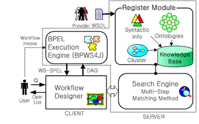

# Ontology Learning Method

* 2015-03-24 / 이용주
* https://blog.naver.com/yjlee3369/220309578192

## 개요

웹 서비스 기술의 주된 단점은 서비스의 발견 및 조합이 아직까지 수작업으로 수행되고 있는 것이다. 이는 오늘날 웹 서비스들이 수없이 증가되고 있는 상황에서 큰 부담이 되고 있다. 최근의 여러 연구들에서 시맨틱 웹 기술을 이용하여 자동적인 웹 서비스 발견 및 조합을 실현하기 위해 기계 가독형으로 웹 서비스 기능을 묘사할 수 있는 메카니즘, 즉 온톨로지(ontology)를 활용하고 있다.

이에 따라 호환 가능한 웹 서비스들 간의 실시간 발견 및 조합이 가능하다. 하지만 이러한 시맨틱 웹 서비스 기술의 성공을 보장하기 위해서는 품질 좋은 온톨로지의 사용이 필수적이다.

최근 온톨로지 사용의 중요성에도 불구하고 현재 웹 서비스를 위한 온톨로지는 거의 존재하지 않으며 이들의 구축도 쉬운 일이 아니다. 왜냐하면 현재 이들 온톨로지는 대부분 전문가의 수작업으로 구축되고 있으며 시간 및 인적 제약 때문에 실용적인 온톨로지를 구축하기가 쉽지 않다.

또한 현시점에서 매일 수백에서 수천 건씩 증가되고 있는 웹 서비스 전체에 대해 온톨로지를 수동 구축한다는 것은 거의 불가능하게 보이며, 이러한 문제는 오늘날 웹 서비스의 확산과 발전을 가로막는 큰 저해 요인이 되고 있다.

본 시스템에서는 웹 서비스를 개발할 때 자동 생성되는 WSDL(Web Service Description Language) 문서만 가지고 항목 간 숨어있는 시맨틱 정보를 찾아내어 온톨로지를 자동 구축하고, 이를 이용한 유사 웹 서비스 오퍼레이션(operation) 발견 방법을 탐구한다. 연구의 핵심 내용은 WSDL 입출력 항목들로부터 의미적으로 같은 개념들을 묶고(clustering), 각 항목들 간의 계층관계(hierarchical relationship)를 형성하여 자동적으로 시맨틱 온톨로지를 구축한다.

그리고 새로운 유사도 측정 방법을 통해 우선순위별 유사 오퍼레이션을 발견하며, 발견된 오퍼레이션들 중 가장 적합한 오퍼레이션을 선택하여 웹 서비스 조합에 직접 적용될 수 있는 웹 서비스 검색 시스템을 구현한다.